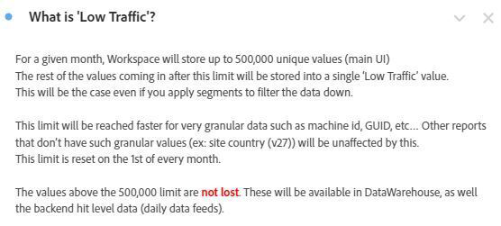

# 在 Analysis Workspace 中建立操作儀表板

_[!DNL Adobe Analytics]探索 Workspace 中的操作儀表板如何徹底改變溝通成效和效率。了解如何建立常見問題、新聞與公告以及錯誤與功能儀表板，以簡化資訊、改進使用者體驗並提升參與度。_

就像許多管理員一樣，我執行內部資訊中心（Confluence或類似專案） [!DNL Adobe Analytics]. 隨著時間的過去，我厭倦了重複回答相同的問題，並且需要一種更順暢的方式來聯繫我的使用者，而不是感覺我一直傳送訊息打擾他們。我需要存放庫來儲存稍微動態的資訊。

我注意到使用者經常忽略我放置的 Confluence 網站連結，原因包括「我的 VPN 已關閉」或「我現在無法讀取」等。基本上，「我稍後會閱讀該文件」表示該使用者不會閱讀，而下週相同的問題會再問一次。

***豁然開朗：**Workspace 的多功能性可能會改變遊戲規則。使用者偏好快速、直接地在 Workspace 中得到答案，因此讓我們將他們留在那裡，避免額外的步驟。*

我繼續建立操作儀表板以分享給全公司。到目前為止，使用者可以得到資訊、資訊集中並減少挫折感。這是一個簡單、持續發展的過程，隨時間過去，效率會不斷提高。

沒有我，人們就能取得許多好資訊，瞭解網站區域，瞭解多酷 [!DNL Adobe Analytics] 是，而且(這對我??很重要)問的問題較少，花費的時間也較少。

**我強烈建議您為所有屬性或網站主要區域建立儀表板。**&#x200B;其中應該提供屬性/網站/應用程式/流量的概觀，以及基本資訊和快速深入分析。它們應該與整個公司共享，讓所有使用者無需任何介入即可了解該屬性。對我來說，這些儀表板通常可幫我回答 80% 的問題，節省我寶貴的時間。

所有這些都不會阻止您保留 Confluence 網站，該網站仍然非常有用。我甚至會在每個操作儀表板頂端放置其參考連結。但我喜歡快捷方法，無論對我還是對我的使用者。

讓我向您解釋一下我為我的公司 GenDigital 建立的三個操作儀表板，它們協助我實現了這些目標。

1. 常見問題集
1. 新聞與公告
1. 錯誤、功能和主要版本記錄

## 1 - 常見問題儀表板

厭倦了無止盡地重複提供答案？停止！製作常見問題儀表板來節省時間。使用者可以提問之前先查閱它，或者您可以使用其快速連結作為回覆。

只需建立[文字視覺效果](https://experienceleague.adobe.com/docs/analytics/analyze/analysis-workspace/visualizations/text.html)，其中問題做為標題，答案/說明做為內容，全部摺疊起來，只顯示問題。按相關性 (例如頁面或產品) 或使用面板將其分組。保持簡潔，常見查詢優先放在頂端。

與其寫長篇電子郵件或重新發現舊的說明，不如更新您的常見問題儀表板。從現在開始並隨時間擴展。使用超連結來參考其他儀表板或報告中的相關常見問題。從其他儀表板連結到常見問題，在需要時提供複雜的內容。

對於Gen Digital，我們的常見問題集側重於客製化 [!DNL Adobe Analytics] 使用，而非基本知識。 按一下滑鼠右鍵並選取「取得視覺化連結」並分享虛名 URL，藉此來寄送包含特定常見問題連結的電子郵件。這為使用者突顯了確切的內容。使用自由格式表格來解釋資料，透過「編輯描述」加入更多說明。

一旦您感覺常見問題非常全面，請分享給全公司供全體存取和學習。視需要不斷加強。

以下是常見問題儀表板外觀的一些螢幕擷圖：

## 2 - 新聞與公告儀表板

另一個有用的操作儀表板是新聞與公告儀表板。我開始這個項目是因為我想提供資訊給使用者，但我覺得我反而像是一直在傳送訊息打擾他們。大家都需要這個更新嗎？哪些使用者需要？只有進階使用者需要？我應該每週發送一份沒有人會讀的電子報嗎？將更新直接放在 Workspace 中，使用者一登入就可以看到它，我不需要另外寄送一封沒有人要讀的公司電子郵件。

由於這些儀表板全公司的人都看得到，因此更新會立即出現在頂端。以下是我會放在新聞與公告儀表板的資訊類型：

- 我們這端的功能發佈和更新 (主要是程式碼發佈)
-  重要新功能[!DNL Adobe]
- 工作時間排程
- 所有要查看的概觀儀表板和有用報告的清單

它涵蓋了我們的新功能、追蹤和重要儀表板。文字報表中的超連結（或透過按一下右鍵並編輯說明而位於其他報表頂端）可讓您連結至中的其他控制面板 [!DNL Adobe Analytics] 或 [!DNL Adobe]的功能發行頁面。

以下是我的新聞與公告儀表板外觀：

## 3 - 錯誤、功能和主要版本記錄

此操作儀表板的目標是有一個集中位置來放置所有錯誤。我以前習慣在 Excel 中管理，但它很麻煩且難以共享。為什麼不直接放在 Workspace 中呢？

您可以將其整合到新聞與公告儀表板 (如果您希望它不要那麼顯著)。但是，如果錯誤報告對您的公司來說很重要或至關重要，那麼單獨的儀表板可能是明智的選擇。

我使用文字視覺效果，並運用項目要點使其非常簡單。項目要點的開頭為錯誤的日期和屬性 (例如：「3jan23-17jan23 - Norton.com」、「2022 年 14 月 14 日之前 - Chat」)。然後我加入詳細資訊並儘量保持簡短。我避免指出哪個團隊出了問題，也避免加入太多使用者可能不在乎的詳細技術資訊。

最新的錯誤位於頂端，而較舊的錯誤位於年度文字報告中 (例如「2022 - 已知錯誤和變更」) - 全部摺疊。

沒什麼花俏技巧。確實很容易做到，而且您必須承認，這比您儲存在硬碟上並在 Confluence 上不斷更新的 Excel 檔案要好得多。

我也在此處放置概觀儀表板和有用報告的參考連結，類似於其他操作儀表板。常見問題以及新聞與公告儀表板的連結位於頂端。

以下是您記錄外觀的範例：

在中建立操作控制面板 [!DNL Adobe Analytics] Workspace改變了我的遊戲規則。 和許多管理員一樣，我管理一個內部中心，並在重複提供答案和有效使用者溝通方面遇到了困難。對動態存放庫的需求讓我認識到 Workspace 的多功能性可以徹底改變使用者參與度。希望您能欣然接受中操作儀表板的強大功能 [!DNL Adobe Analytics] 工作區。 增強您的使用者體驗、節省時間並享受更有條理的環境。您的旅程從現在開始，這些儀表板是提升效率和使用者友善的關鍵。

## 作者

本文件的作者為：

**Christel Guidon**，數位 [!DNL Analytics] Gen平台管理員

[!DNL Adobe Analytics] 冠軍
