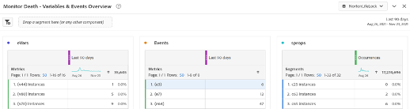

# 下載[!DNL Adobe Analytics]實施行動手冊

開始之前，請[下載行動手冊](assets/aa-implementation-playbook.xlsx)。

## 業務需求標籤

**主題：**&#x200B;業務需求檔案（通常稱為BRD）是關鍵利害關係人、業務使用者和技術使用者希望能合作處理的重要檔案。 它是用來記錄所有您想要的KPI、報告要求以及您希望在[!DNL Adobe Analytics] (AA)實施完成時看到的任何資料點。

**理由：**&#x200B;此檔案是後續檔案（SDR、技術規格等）的出發點，也是商定AA最終狀態的共同信任來源。 本檔案將組織內各個團隊的想法整理在一起，形成一個指導方向，以推進建置或增強實施的過程。

**做法：**&#x200B;記載業務需求通常由AA的一般業務使用者完成，但重要的是取得技術使用者的意見回饋，因為可能會有需要注意的技術挑戰，而且某些資料點可能需要比其他資料點更努力，這會影響優先順序。

問問自己，「我們希望在網站上追蹤哪些專案」、「哪些資料點對於報告使用情況很重要」，以及最重要的，「這些資料點將如何為決策提供資訊」。 請務必確保您的每個業務需求都與可用於做出業務決策的資料點相關。 例如，您可能很想追蹤網站上的每一次點按，但歸根結底，您從報表中收集哪些深入見解？

首先，填寫下方熒幕擷圖中的C欄（業務需求）。 這應該類似於「我們的網站上完成了多少內部搜尋」或「在印象方面，哪個內部行銷活動位置最有效」。 填寫完這種程度的詳細資料後，您可以返回填寫B欄（類別），並將需求分組為「搜尋」或「內部促銷」等類別，且應妥善對應至您的技術規格區段。

您也要表明是否認為使用eVar、事件、Prop或多項組合可以達成想要追蹤的目的。

最後，當您開始向網站新增內容時，「實施狀態」欄將當作狀態檢查。

## 變數對應標籤（標籤檔案/SDR）

**主題：**&#x200B;標籤檔案（通常稱為SDR）是對AA技術和業務使用者都極具價值的重要檔案。 它列出報告套裝使用的每個變數，以及變數設定的所有相關詳細資料、變數的實施方式及其在報告中的用途。 和屬性檔案一樣，這應該是控管良好的作用中Excel檔案，並有一個負責人在引進標籤增強功能或實施變更時負責更新檔案。

**理由：**&#x200B;本檔案有許多用途，但最重要的是：

* 對於不熟悉實施的新手（新員工、希望深入瞭解可用報告的企業負責人等），本檔案可提供所有實施變數及其用途的最佳檢視，讓個人可以自助學習您的AA設定。
* 對於AA產品所有者/技術使用者，本檔案可提醒如何設定其他變數，以及在新增維度時可以使用哪些變數。

**做法：**&#x200B;首先，在Excel檔案中列出所有[!DNL Adobe]個現成可用的變數（頁面、產品、地理等），以及eVar、prop、事件和清單變數。 每個網站/報表套裝都應該有一個標籤。
對於每個維度，我都會新增下列欄：

* **名稱：**&#x200B;提供大部分人都能理解的簡單短名稱。 這應該足夠直覺，讓新使用者可以馬上瞭解變數要擷取的內容。
* **說明：**&#x200B;變數用途和其追蹤資料的更多詳細資料。 我會讓此專案保持簡短和簡單，並符合介面中使用的說明。 理想情況下，我不希望我的使用者需要查閱標籤檔案。 因此，在管理員後端設定新維度時，我也會新增相同的說明。 如此一來，使用者就能直接在Workspace中點選資訊圖示，瞭解維度是什麼 — 不需要開啟Excel檔案！

* **代碼：**&#x200B;設定值的後端代碼。 這可以是頁面上資料層的欄位，或也可以標註這是透過Launch規則、處理規則等專案完成的。
* **分類報告：**&#x200B;標註使用分類匯入工具或分類規則產生器完成的任何分類報告
* **解決方案範圍：**&#x200B;我覺得在小欄中列出所有屬性（至少是使用超過標準變數的屬性）並為在該屬性上設定的每個維度新增核取記號很有用。 這可讓您輕鬆篩選特定屬性，以及快速檢視特定維度的設定位置。
* **設定：**&#x200B;每個變數的管理員UI設定（亦即對於eVar — 到期、配置、銷售等）

範例SDR的熒幕擷圖：

此外也建議使用此標籤檔案來追蹤任何自由變數和任何「垃圾」變數。 當維度不再有用時，開發人員通常需要一段時間才能刪除維度。 即使在這之後，也可能會發生快取，或者您可能發現在其他位置也設定了該維度。 清理維度並不容易，通常需要耐心。 以下提供一些秘訣，可協助您把垃圾隱藏起來，讓使用者在追蹤時不會感到困惑。

* 所有未使用的維度/事件是「自由的」或「正在刪除」
   * 如果維度在過去90天內有垃圾值，則它「正在刪除」
   * 如果維度在至少過去90天內是自由且清除的，則為「自由」維度
   * 在標籤檔案中的「名稱」下如此標籤這些專案，就能輕鬆篩選它們。 我會在標籤檔案（Excel資料篩選器）中取消勾選這些專案，這樣使用者就看不到它們
   * 在介面中將這些專案標籤為eVar名稱，讓使用者在搜尋中找不到它們(亦即「(v6)」)並移除介面中的說明
* 藉由執行此操作，當需要新維度時，您就可以輕鬆地在「名稱」欄位中篩選「自由」，以尋找可使用的乾淨維度
* 對於「正在刪除」的維度和事件，建議您使用Workspace來追蹤：
   * 建立只有3個表格且顯示給管理員的專案：eVar、prop和events。 例如，我對特定eVar使用「例項」，而對於prop，我使用「prop5存在」建立HIT區段。
   * 將日期設為過去90天
   * 將上述專案用作3個表格中的列以及發生次數
   * 當任何專案取得「0」，我就會在標籤檔案中將其標籤為「自由」，並將其從Workspace專案中移除

如此一來，您的資料永遠都是乾淨的，您也能清楚掌握您的垃圾。

## 屬性標籤

**主題：**&#x200B;內容檔案應列出所有數位內容 — 網站、行動應用程式、其他工具（聊天、意見回饋等），無論這些內容是否標有[!DNL Adobe Analytics]。 這應該是跨業務和技術使用者的集中式作用中檔案。

**理由：**&#x200B;這可讓您清楚瞭解使用者在所有數位屬性中的旅程，以及[!DNL Adobe Analytics]涵蓋和未涵蓋的內容，因此您可以優先為缺少標籤的屬性新增標籤。 以這種方式配置您的數位生態系統，可以找出標籤策略中的潛在機會，進而全面瞭解使用者的旅程。 例如 — 您是否需要全域報表套裝來追蹤多個網域/網站？ 網域或應用程式之間是否需要將訪客ID切換至混合體驗？ 是否需要更新內部URL篩選器以進行跨網域追蹤？

**做法：**識別檔案的所有者，以提供控管和管理更新的單一責任來源。
在屬性標籤上列出下列內容：

* **屬性名稱：**&#x200B;這可以是網域、子網域、應用程式名稱等。 即使在同一個網域中，如果某些部分是分開管理的（例如由不同的團隊或不同的技術管理），這些應該分離出來。
* **連結(URL)**&#x200B;到可用的屬性
* **擁有者和聯絡人：**&#x200B;列出屬性的主要擁有者或聯絡人
* **標籤方法：**&#x200B;我們許多人都採用不同的程式碼方法和實作(Launch、JS檔案、AEP等)。 您可以視需要進一步劃分（例如透過程式碼版本或標籤管理系統），但這是用於追蹤所有不同的程式碼方法和版本、哪裡需要更新程式碼，以及需要如何維護。 如果您使用[!DNL Adobe] Launch，請列出Launch屬性名稱。

請記得加入所有數位內容，即使它們沒有使用[!DNL Adobe Analytics]標籤。 這可協助您瞭解您的數位環境，以及使用者如何與您的所有屬性互動。

建議將此檔案儘可能保持簡單，不要塞入太多資訊，好讓組織的不同部門易於理解。 [!DNL Analytics]團隊通常比任何其他團隊都更瞭解數位環境，因此本檔案通常是其他團隊和高階主管用來提供徹底的概觀。

>[!TIP]
>
>在[!DNL Adobe Analytics]中建立網站名稱/屬性維度。 在[!DNL Adobe Analytics]中擁有專門用於識別網站名稱/應用程式名稱的專用維度(通常是eVar)，可允許進行分段、疑難排解、虛擬報告套裝建立等。 其好處無窮無盡，尤其是在一個（全域）報告套裝中結合多個網站時。 關鍵是確保開發團隊一律在屬性維度中設定此值，包括所有頁面載入（s.t呼叫/trackState）和所有自訂事件（s.tl呼叫/trackAction）。 處理規則可以是有價值的工具，可協助您正確且一致地設定這些值。

[觀看Doug Moore製作的這部影片](https://experienceleague.adobe.com/docs/analytics-learn/tutorials/implementation/implementation-basics/creating-a-business-requirements-document.html){target="_blank"}，瞭解填寫實施行動手冊的詳細資訊。

## 作者

本文的共同作者為：

NortonLifeLock的數位[!DNL Analytics]平台管理員Christel Guidon
[!DNL Adobe Analytics]冠軍

[!DNL Adobe]資深顧問Rachel Fenwick
