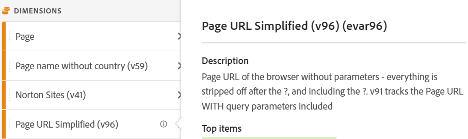

# 下載 [!DNL Adobe Analytics] 實施行動手冊

開始之前，請先[下載行動手冊](assets/aa-implementation-playbook.xlsx)。

## 業務需求標籤

**主題：**&#x200B;業務需求文件 (通常稱為 BRD) 是關鍵利害關係人、業務使用者和技術使用者希望能合作處理的重要文件。 它是用來記錄所有您想要的KPI、報告要求以及您希望何時看到的任何資料點。 [!DNL Adobe Analytics] (AA)實施完成。

**理由：**&#x200B;此文件是後續文件 (SDR、技術規格等) 的出發點 也是商定 AA 最終狀態的共同信任來源。 本文整理了組織內各個團隊的想法，形成一個指導方向，以推進建構或增強實施。

**做法：**&#x200B;記載業務需求通常由 AA 的最終業務使用者完成，但重要的是取得技術使用者的意見回饋，因為可能會有需要注意的技術挑戰，此外某些資料點需要的工作可能比其他資料點更多，這會影響優先順序。

您不妨自問：「我們希望在網站上追蹤哪些項目」、「哪些資料點對於報告使用情況很重要」，以及最重要的：「這些資料點如何為決策提供資訊」。 請務必確保您的每個業務需求都與可用於做出業務決策的資料點相關。 例如，您可能很想追蹤網站上的每一次點擊，但最終您從報告收集哪些深入見解？

首先填寫下面螢幕擷圖中的 C 欄 (業務需求)。 這應該類似於「我們的網站上完成了多少內部搜尋」或「在印象方面，哪個內部行銷活動位置最有效」。 填寫完這種程度的詳細資料後，您可以返回填寫 B 欄 (類別)，並將需求分組為「搜尋」或「內部促銷」等類別，且應妥善對應至您的技術規格區段。

您也要表明是否認為使用 eVar、事件、prop 或多項組合可以達成想要追蹤的目的。

最後，當您開始向網站增加內容時，「實施狀態」欄將當作狀態檢查。

## 變數對應標籤 (標記文件/SDR)

**主題：**&#x200B;標記文件 (通常稱為 SDR) 是對 AA 技術和業務使用者都極具價值的重要文件。 其中列出報告套裝使用的每個變數，以及變數設定的所有相關詳細資料、變數的實施方式及其在報告中的用途。 與屬性文件一樣，這應該是控管良好的作用中 Excel 文件，並有一個負責人在引進標記增強功能或實施變更時負責更新文件。

**理由：**&#x200B;本文件有許多用途，但最重要的是：

* 對於不熟悉實施的新手 (新員工、希望更加了解可用報告的企業負責人等) 本文件提供了所有實施變數及其用途的最佳視圖，讓個人可以自助學習您的 AA 設定。
* 對於 AA 產品所有者/技術使用者，本文件可提醒如何設定其他變數以及新增維度時可以使用哪些變數。

**做法：**[!DNL Adobe]首先，在 Excel 文件中列出所有 開箱即用的變數 (頁面、產品、地理等)，以及 eVar、prop、事件和清單變數。 每個網站/報告套件都應該有一個標籤。
對於每個維度，我增加了下列欄：
* **名稱：**&#x200B;提供大部分人都能理解的簡易短名稱。 名稱必須夠直覺，讓新使用者可以馬上了解該變數要擷取的內容。
* **說明：**&#x200B;變數用途和其追蹤資料的更多詳細資料。 我會讓此項目保持簡短和簡單，並符合介面中使用的說明。 理想情況下，我不希望我的使用者需要查閱標記文件。 因此，在管理員後端設定新維度時，我也會新增相同的說明。 這樣一來，使用者就能直接在工作區中點擊資訊圖示，了解維度是什麼 - 不需要開啟 Excel 文件！

* **程式碼：**&#x200B;設定值的後端程式碼。 這可以是頁面上資料層的欄位，或也可以標註這是透過 Launch 規則、處理規則等項目完成的。
* **分類報告：**&#x200B;標註使用分類匯入工具或分類規則產生器完成的任何分類報告
* **解決方案範圍：**&#x200B;我覺得在小欄中列出所有屬性 (至少是使用超過標準變數的屬性) 並為在該屬性上設定的每個維度新增核取記號很有用。 這可讓您輕鬆篩選特定屬性，以及快速查看特定維度的設定位置。
* **設定：**&#x200B;每個變數的管理員 UI 設定 (亦即對於 eVar - 到期、配置、銷售等)

範例 SDR 的螢幕擷圖：

此外也建議使用此標記文件來追蹤任何自由變數和任何「垃圾」變數。 當一個維度不再有用時，開發人員通常過一陣子才會刪除它。 而即使刪除了，也可能發生快取，或者您可能發現在其他位置也設定了該維度。 清理維度並不容易，通常需要耐心。 以下提供一些秘訣，可協助您把垃圾隱藏起來，讓使用者在追蹤時不會感到困惑。

* 所有未使用的維度/事件是「自由的」或「正在刪除」
   * 如果維度在過去 90 天內有垃圾值，則它「正在刪除」
   * 如果維度在至少過去 90 天內是自由且清除的，則它是「自由的」
   * 在標記文件中的「名稱」下如此標記這些項目，就能輕鬆篩選它們。 我在標記文件 (Excel 資料篩選器) 中不會勾選這些項目，這樣使用者就看不到它們
   * 在介面中將這些項目標記為 eVar 名稱，讓使用者在搜尋中找不到它們 (亦即「(v6)」) 並移除介面中的說明
* 這樣一來，當需要新維度時，您就可以輕鬆地在「名稱」欄位中篩選「自由」，找到可使用的乾淨維度
* 對於「正在刪除」的維度和事件，建議您使用工作區來追蹤：
   * 建立只有 3 個表格且顯示給管理員的專案：eVars、props 和 events。 例如，我對特定的 eVar 使用「實例」，而對於 props，我使用「prop5 存在」建立 HIT 區段。
   * 將日期設定為過去 90 天
   * 將上述項目用作 3 個表格中的列以及發生次數
   * 當任何項目取得「0」，我就會在標記文件中將其標記為「自由」，並將其從工作區專案中移除

這樣一來，您的資料永遠都是乾淨的，您也能清楚掌握您的垃圾。

## 屬性標籤

**主題：**[!DNL Adobe Analytics]屬性文件應列出所有數位屬性 - 網站、行動應用程式、其他工具 (聊天、意見回饋等)，無論這些屬性是否使用 標記。 這應該是跨業務和技術使用者的集中式作用中文件。

**理由：**[!DNL Adobe Analytics]這可讓您清楚了解使用者在所有數位屬性中的旅程，以及 有涵蓋和未涵蓋的範圍，因此您可以優先向缺少標記的屬性新增標記。 以這種方式配置您的數位生態系統，可以找出標記策略中的潛在機會，進而全面了解使用者的旅程。 例如 - 您是否需要全域報表套件來追蹤多個網域/網站？ 網域或應用程式之間是否需要將訪客 ID 遞交到混合體驗？ 是否需要更新內部 URL 篩選器以進行跨網域追蹤？

**做法：**確定文件的所有者，以提供控管和管理更新的單一責任來源。
在屬性標籤上列出以下內容：
* **屬性名稱：**&#x200B;可以是網域、子網域、應用程式名稱等。 即使在同一個網域中，如果某些部分是分開管理的 (例如由不同的團隊或不同的技術管理)，這些應該分離出來。
* **連結 (URL)** 到可用的屬性
* **所有者和聯絡人：**&#x200B;列出屬性的主要所有者或聯絡人
* **標記方法：**&#x200B;我們許多人都採用不同的程式碼方法和實施 (Launch、JS 檔案、AEP 等)。 您可以視需要進一步劃分 (例如透過程式碼版本或標籤管理系統)，但這是用於追蹤所有不同的程式碼方法和版本、何處需要更新程式碼，以及需要如何維護。 如果您使用 [!DNL Adobe] Launch，列出Launch屬性名稱。

請記得加入所有數位屬性，即使它們沒有標籤 [!DNL Adobe Analytics]. 這有助於您了解您的數位環境，以及使用者如何與您的所有屬性進行互動。

建議將此文件盡可能保持簡單，不要塞入太多資訊，好讓組織的不同部門易於理解。 [!DNL Analytics] 團隊通常比任何其他團隊都更瞭解數位環境，因此本檔案通常是供其他團隊和主管使用以提供徹底概覽。

>[!TIP]
>
>在中建立網站名稱/屬性維度 [!DNL Adobe Analytics]. 在中擁有專用維度(通常是eVar) [!DNL Adobe Analytics] 可識別網站名稱/應用程式名稱，允許進行分段、疑難排解、虛擬報表套裝建立等。 其好處無窮無盡，尤其是在一個 (全域) 報告套裝中結合多個網站時。 關鍵是確保開發團隊一律在屬性維度中設定此值，包括所有頁面載入 (s.t 呼叫/trackState) 和所有自訂事件 (s.tl 呼叫/trackAction)。 處理規則可以是有價值的工具，可協助您正確且一致地設定這些值。

[觀看Doug Moore製作的這段影片](https://experienceleague.adobe.com/docs/analytics-learn/tutorials/implementation/implementation-basics/creating-a-business-requirements-document.html){target="_blank"} 以取得填寫實施行動手冊的詳細資訊。

## 作者

本文的共同作者為：

Christel Guidon，數位 [!DNL Analytics] NortonLifeLock的平台管理員
[!DNL Adobe Analytics] 冠軍

 資深顧問 Rachel Fenwick[!DNL Adobe]
