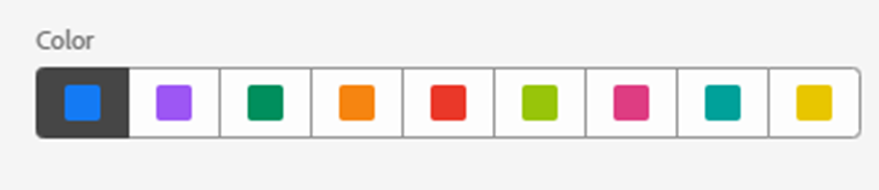

# 釋放分析見解；利用註釋的力量

註解資料元件是最簡單但長遠而言是AdobeAnalysis Workspace中提供的最省時的功能之一。 與Workspace內的任何其他功能不同，它可當作您和您的Workspace同僚使用者的敘述性歷史記憶體。

簡言之，註解是可新增到AdobeWorkspace中日期趨勢資料的簡短說明文字。 註解可為使用Analysis Workspace瞭解公司資料歷史的每個人提供上下文，有助於更快速地分析效能，並為您的所有報表提供高度自訂的感覺。

## 使用案例

在多種情況下，註解都特別實用：

- **離群值（波峰與波谷）** — 如果您知道趨勢資料的主要波峰與波谷的原因，請以滑鼠右鍵按一下離群值資料點，並選擇[附註選擇]來與所有人分享這些知識。

- **主要行銷活動和測試** — 作為行銷活動和測試（A/B、多變數等） 直接影響流量和效能，讓每個人都能輕鬆地在註解中記錄這些行銷活動和測試的時間範圍。

- **外部因素與事件** — 無論是重大單次事件、競爭者動作、新產品發行或是相關的全球或國內事件，請務必在「註解」中加入任何與資料相關的外部因素。

- **間隔和錯誤** — 您應該使用警示功能來警告您潛在的資料收集問題，但即使是最老練的團隊不幸也會偶爾遇到某些形式的資料收集錯誤或暫時性的間隔。 註解是讓使用者知道資料遺失或不完整的絕佳方法，藉此將影響降至最低。

## 操作說明

建立和編輯註解是直覺式的，幾乎可以一目瞭然。 以滑鼠右鍵按一下日期趨勢視覺效果或自由表格內的資料點，然後選擇「附註選取範圍」以建立附註，或使用導覽至「元件>附註」的主要功能來建立和編輯附註。

{width="70%"}{width="30%"}

如需註解如何運作的所有詳細資訊，請務必參閱Experience League[&#128279;](https://experienceleague.adobe.com/en/docs/analytics-learn/tutorials/analysis-workspace/navigating-workspace-projects/annotations-in-analysis-workspace)上的影片教學課程。

## 開始使用的秘訣與技巧

最後，以下提供一些實用的秘訣，協助您開始使用註解。  使用這些建議有助於讓您的註解對所有使用者有效、清楚且提供資訊。

- **色彩編碼** — 註解功能可讓您從出現在Workspace專案中的一系列色彩中進行選取，以幫助您區分各種型別的註解。 如果您測量多個不同的網站或應用程式，則可以針對每個網站或應用程式選擇不同的顏色。 或每個註解類別使用不同的顏色。

- **標題標籤** — 為使用者提供有關註解的簡單視覺提示的額外方法是為註解的標題加上標籤。 與色彩編碼類似，您可以根據組織建構資料的方式選擇不同的標籤，例如依頻道或名稱（即WEB、APP或ALL）

- **範圍** — 建立註解時，您可以任意使用完整的維度、量度和限制器，以便在適當的內容中顯示註解。 有些註解僅與特定維度或量度相關，因此您可以限制註解顯示至相應維度或量度的時間。

- **另存新檔** — 建立一兩個註解後，您可以使用省時的「另存新檔」選項，將它們重新用作範本以建立新註解。

- **註解管理員** — 使用「元件>註解」的主要導覽功能來存取註解管理員，您可在此找到更多建立及編輯註解的廣泛功能。

- **許可權 —**&#x200B;如果您無法建立註解，請洽詢可以在Admin Console中允許「註解建立」的管理員。

如需詳細檔案，請造訪[註解概觀](https://experienceleague.adobe.com/en/docs/analytics/analyze/analysis-workspace/components/annotations/overview)和周圍文章。

## 作者

本檔案的作者為：

Miles &amp; More （漢莎集團）Data Warehouse與Business Intelligence經理Thomas Edward Buckley
