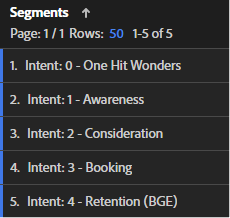

# 建置客戶歷程區段

瞭解如何在中建立行為型客戶歷程區段 [!DNL Adobe Analytics] 並改善客戶體驗，透過 [!DNL Adobe] 請依照此逐步指南進行Experience Cloud。

讓我們建立更好的客戶歷程區段！ 在此系列中，我們將使用 [!DNL Adobe Analytics] 定義行為型區段、估計對象人數並追蹤使用者動向。 到最後，您將能夠個人化媒體並改善客戶體驗，使用 [!DNL Adobe] Experience Cloud。 請記住，這些區段目前運作，並應隨著您進一步瞭解客戶而更新。 雖然報告可能會帶來一些挑戰，但別擔心，我會引導您完成報告！ 讓我們從「單次點選奇蹟」區段開始，建立我們的第一組「客戶歷程」區段。

今天，我們將為第一組Customer Journey區段建立預留位置，建置 [!DNL Adobe Analytics] 工作區可協助我們定義區段，並定義我們的第一個區段「單次點選奇蹟」。

此系列結束時，您將能夠在中建立客戶歷程區段 [!DNL Adobe Analytics] 根據行為訊號。 您將能夠估計歷程每個階段中每個對象的大小，並瞭解使用者在這些階段之間的移動速率。 而且您可以將這些客戶歷程受眾匯出至 [!DNL Adobe] 啟用個人化和媒體鎖定目標的Experience Cloud。

每個企業都不一樣，這表示您的客戶歷程區段看起來會與我的不同。 因此，建議不要為您的區段指定特定的公式，而是要檢視的一些事情以及建立這些公式的整體過程。

也請務必注意，您的客戶歷程區段將是活躍區段。 這不是一個簡單的練習。 當您進一步瞭解客戶時，將會更新這些區段。 這對報告提出一些挑戰。 人們希望報表保持一致，如果區段定義變更，報表中的數字也會變更。

## 開始使用造訪意圖區段

建立客戶歷程區段的第一步，是使用行為訊號，以及（如果有的話）「客戶心聲」資料，來推斷訪客出現在您網站上的原因。 我們將建立一組造訪意圖區段，以分類網站上的所有造訪。 此時，我們的造訪意圖區段必須互斥且完全詳盡。 每次造訪應屬於一個造訪意圖區段，且只能屬於一個。

造訪意圖區段會說明造訪，因此我們將在區段定義中使用造訪容器。

我的初始造訪意圖區段集包括：

* 單次點選奇蹟
* 意識
* 考量事項
* 預訂（購買）
* 保留（管理預訂/購買）

為了讓我的造訪意圖區段易於使用，我在區段名稱前面加上「意圖：」，提供數字以啟用排序，並標籤它們「意圖」。 我的區段看起來就像下圖。

**使用具有頁面檢視>= 1預留位置定義的「造訪」容器，建立您的造訪意圖區段。**

如我們所見，建立這些區段是一項反複且相互關聯的程式。 我將在日後的文章中說明建立這些區段的程式。

## 造訪意圖區段資料品質工作區

我使用簡單的工作區，確保自己定義好造訪意圖區段。 請記住，每次造訪都必須屬於一個造訪意圖區段，且只能屬於一個。 我設定的工作區可確保將所有造訪皆納入考量，且區段之間不會重疊。

我使用「資料品質」、「造訪意圖」和「客戶歷程」標籤將此工作區命名為「資料品質：造訪意圖區段」。 稍後，我們將建立「造訪意圖控制面板」，前置詞「資料品質」表示此工作區是用於設定和維護區段。 這是一個管理儀表板，幾乎沒有業務深入解析，但對於確保維持區段非常重要。 建議您定期回到此儀表板或設定警報，以確保您的區段維持正確定義。

此工作區中最重要的視覺效果是左中角的「區段重疊」自由格式視覺效果。 使用造訪量度，為每個造訪意圖區段建立欄篩選器，並在最右邊欄中建立所有造訪區段。 在左側為每個造訪意圖區段建立列。 您現在會有交叉表視覺效果。 當您的區段設定正確時，每個造訪意圖區段與其本身的交集處僅會有一欄一列有資料。

其次最重要的視覺效果是左上角的摘要量度。 區段瀏覽摘要的值取自下方區段重疊視覺效果中的所有瀏覽欄。 「所有造訪」摘要有其本身的隱藏表格。

在右上角，我已在每個區段新增額外的量度，以提供區段成形的一些「風格」。 尤其是，由於這些區段互斥，我只會預期看到預訂意圖區段的預訂（不用擔心，當我們以訪客為基礎建立這些造訪意圖區段時，我們會獲得轉換率）。

請記住，我們剛才已建立預留位置區段。 因此，您的工作區一開始看起來很奇特。 您的所有造訪意圖區段都將重疊100%，因為它們有相同的定義。 這是正確的，而且正是您在這個過程中想要看到的內容。 當我們建立區段定義時，您會開始看到這些區段開始成型。

## 建立您的第一個造訪意圖區段

定義造訪意圖區段有點像是消除的過程，而且它們之間有許多相互依存關係。 因此我沒有依照歷程的順序建立這些區段，而是依照從最容易定義到最具挑戰性的順序來建立。 這給了我這個順序：

1. 方法： 0 — 單次點選奇蹟
1. 目的： 3 — 預訂
1. 目的： 4 — 保留
1. 目的：2 — 考量
1. 目的： 1 — 意識

相當隨機，嗯？ 定義這些造訪意圖區段是一個反複的、前後對照的過程，通常一個區段的調整需要更新其他區段。 當我說明如何定義每個區段時，畫面會變得更清晰。

今天，我們將定義第一個也是最簡單的區段，單次點選奇蹟

## 建立「單次點選」奇蹟區段

我的第一個區段「One Hit Wonders」很容易定義。 這僅僅是一次僅有一個頁面檢視的造訪。 我們真的不知道為什麼該使用者會出現在網站上，因為他們會跳出。 我猜我們可以根據他們的登入頁面來猜測意圖，但僅有一個頁面檢視，沒有足夠的資訊來做出對意圖的知情推測。

定義此區段後，您就會開始看到造訪意圖工作區成型。

使用建立客戶歷程區段 [!DNL Adobe Analytics] 是一個富有挑戰性但回報豐厚的過程。 透過建立行為型區段、估計受眾規模並追蹤使用者行動，企業可以個人化媒體並改善客戶體驗。 每個企業都是獨一無二的，沒有建立區段的特定公式，但需遵循的准則和流程。 隨著企業進一步瞭解其客戶，應更新區段，這會帶來報告挑戰。 透過遵循建立造訪意圖區段的流程，企業可以改善整體客戶體驗。

## 作者

本文件的作者為：

**Aaron Fossum**， Director，數位 [!DNL Analytics]

[!DNL Adobe Analytics] 冠軍
