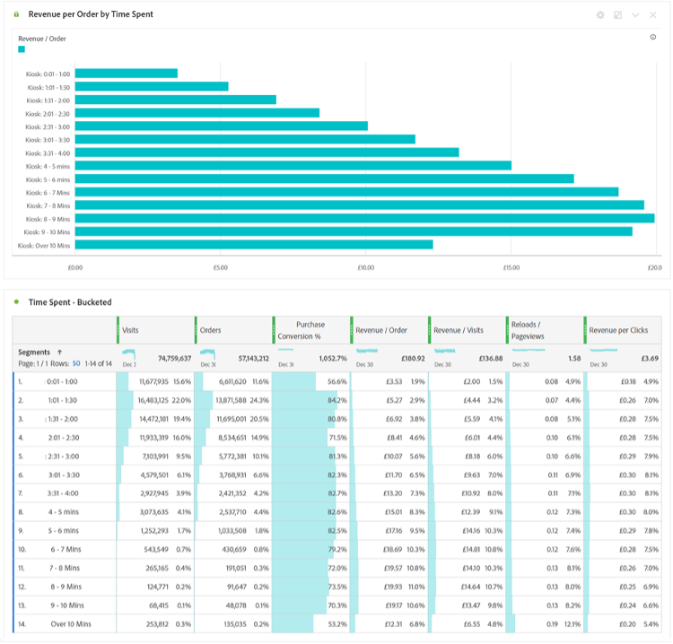

# 現在只需等待區段……使用區段在Analysis Workspace中探索新的深入分析

無論您是新[!DNL Adobe Analytics]使用者或經驗豐富的專家，都將在您的Analysis Workspace專案中善用一些區段。 如[[!DNL Adobe] Experience League](https://experienceleague.adobe.com/docs/analytics/components/segmentation/seg-overview.html?lang=zh-Hant)所述，「區段可讓您根據特性或網站互動來識別訪客的子集」。 雖然此功能的基本成果表示將使用者群組、造訪或點選隔離到您的網站，但像您這樣思維敏銳的分析人員可以使用此工具發揮創意，並找到獲得有關網站活動深入分析的新方式。 可能的選項清單非常龐大，所以請隨時嘗試建立您自己的選項，並在您的組織或社群(例如Experience League上的[[!DNL Adobe Analytics] 社群](https://experienceleaguecommunities.adobe.com/t5/adobe-analytics/ct-p/adobe-analytics-community)或Slack[#Measure社群](https://www.measure.chat/)社群)中與他人分享。

如果您需要有關如何建立區段的快速複習程式，請參閱有關在Analysis Workspace中使用[區段產生器](https://experienceleague.adobe.com/docs/analytics/components/segmentation/segmentation-workflow/seg-build.html?lang=zh-Hant)的Experience League檔案。

## 比較和對比區段

在Analysis Workspace中，您可以使用&quot;[區段比較](https://experienceleague.adobe.com/docs/analytics/analyze/analysis-workspace/panels/segment-comparison/segment-comparison.html?lang=zh-Hant)&quot;來比較兩個區段。 區段比較可在左側導覽列的「面板」區段中找到：

不過，有時您不需要完整的比較面板，就能將關鍵深入解析帶給一般使用者。 值得慶幸的是，某些功能也可以在標準面板中比較。

[文氏圖表視覺效果](https://experienceleague.adobe.com/docs/analytics/analyze/analysis-workspace/visualizations/venn.html?lang=zh-Hant)可協助建立快速比較，讓您暫留並檢視重疊的工作階段、訂單、使用者等。 介於2至3個自訂區段之間。 您也可以對任何重疊區段按一下滑鼠右鍵，以快速建立區段：

有時重要資訊並不在重疊資料中，而是不重疊的資料。 快速檢視此情形的方法是建立一個區段副本，並將其設為「排除」區段：

將「排除」區段與比較中的其他區段棧疊在一起，您現在可以快速計算有多少次造訪點選您的功能表頁面，而不需在相同工作階段中檢視首頁：

## 棧疊攻擊

同樣地，只要將任何區段棧疊在一起，就可以建立文氏圖表的交集資料。 您棧疊的區段或個別維度數量沒有限制。 例如，如果我想快速瞭解上個月我網站在行動電話（尤其是Samsung Galaxy A52s）上造訪了哪些星期，該手機確實看到了我的功能表和營養頁面，但沒有看到我的首頁，我可以快速建置它，如下所示：

但更棒的是，一旦我找到使用者或造訪基礎的完美子集，我就能選取這些值、按一下右鍵，並立即建立區段：

在一個區段中就能發揮很大的威力。

## 許多區段的數字區段

許多使用者在建立區段時，通常會檢視額定、序數或間隔值，例如造訪的頁面、使用者的年齡範圍或使用者過去造訪的次數。 不過，在建立區段時，您也可以使用比率資料，方法是對這些值進行分組，不論這些值是標準維度、標準量度或組織的自訂變數和量度皆然。

例如，「頁面逗留時間」或「每次造訪逗留時間」有預先建立的可用值區：

不過，這些也許並不總是符合您組織的需求 — 也許網站的大部分造訪時間都少於10分鐘。 您可以使用精細測量，建立不同大小的貯體。 以下是用來檢視持續1分鐘、1秒和1分鐘、30秒之間的造訪的建立專案：

建立後，我就可以開始依自訂的不同分組時間群組檢視造訪、訂單和其他事件：

您甚至可以開始檢查關鍵績效指標(KPI)如何隨著使用者花費的時間、在造訪中點選的頁面數、過去造訪的次數或任何其他數值而變化，基本上可讓您檢視量度作為另一個量度的因素：

使用區段來尋找新見解的可能性是無限的！ 這只是起點。 請自己試試幾個，讓社群知道您發現的內容：Experience League上的[[!DNL Adobe Analytics] 社群](https://experienceleaguecommunities.adobe.com/t5/adobe-analytics/ct-p/adobe-analytics-community)或[#MeasureSlack](https://www.measure.chat/)社群。

分段快樂！

## 作者

本檔案的作者為：

**Dan Cummings**，McDonald&#39;s Corporation資深產品工程[!DNL Analytics]經理

[!DNL Adobe Analytics]冠軍
