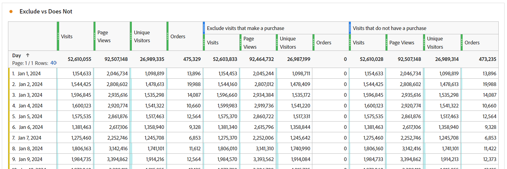

# 幕後的魔術：複雜的區段：排除、容器和歸因

_發掘複雜資料區段的複雜性，探索排除專案、容器和歸因模型。 就像魔術師的詭計，掌握這些技巧可讓分析師執行資料魔術，以精確和巧妙的方式轉換見解。_

窗簾已開啟，舞台已設定……這可能不是拉斯維加斯的魔術表演，但在建立我們的區段時，我們可以執行一些令人驚豔的技巧。

在本單元中，我們將涵蓋：

- 排除邏輯
- 使用容器
- 歸因模型

## 包含與排除

依預設，所有容器都會以&#x200B;**包含**&#x200B;型別開始，這基本上表示它們會傳回符合條件的資料。 不過，您也可以將區段或區段內的容器變更為&#x200B;**排除**&#x200B;型別，讓您拒絕某些條件。

雖然魔術師可以在紙牌中找到您的卡片，但是魔術師可以讓紙牌中的其他部分不復存在，這的確令人吃驚。 同樣地，在排除區段中，我們希望不需要的資料從資料集中消失。

您可能正坐在那裡想：「好吧，但我已經有『不等於』和『不包含』的選項了，所以這應該涵蓋我嗎？」 不幸的是，這個問題的答案是否定的……而且這不僅僅是能夠透過單一元素排除邏輯群組。 即使處理單一元件，您通常仍需使用&#x200B;*排除*&#x200B;才能達成目標。

- **不包含/不等於** — 就是它聽起來那樣，符合不包含特定字串的專案
- **排除：值包含/ equals** — 這將&#x200B;*排除符合字串的*&#x200B;專案

乍一看，這兩個專案的聲音相同……而且在&#x200B;**點選**&#x200B;層級區段/容器上，您會是正確的，因為它們會執行相同的動作。 但是，當使用&#x200B;**造訪**&#x200B;或&#x200B;**訪客**&#x200B;範圍時，您會得到截然不同的結果。

**圖1：不包含/不等於 — 點選範圍**

*請注意，每個點選都會傳回true或false值，而且這些值在不排除和排除之間反轉。*

- &quot;Value&quot;是否包含&quot;Example&quot; （是），因此傳回true且包含該點選；同樣地，&quot;Example&quot;是否包含&quot;Example&quot; （否，不包含），因此傳回false且不包含該點選。 基本上，會傳回任何傳回真實結果的資料。
- &quot;Value&quot;是否包含&quot;Example&quot; (no)，因此傳回false，且不排除該點選；同樣地，&quot;Example&quot;是否包含&quot;Example&quot; (yes)，因此傳回true，並排除該點選。 基本上，傳回&#x200B;**不**&#x200B;有True結果的資料，或傳回False資料至您的條件。
- 您可以看到在&#x200B;**點選**&#x200B;層級，兩組邏輯都會傳回相同的資料集。

**圖2：不包含/不等於 — 造訪範圍**

*如上所述，**造訪**&#x200B;內的每個點選將會以相同的true / false進行評估。 但是，傳回的資料集是整個造訪的資料集。*

- 在每個點選上，「Value」不包含「Example」（是），因此傳回true；同樣地，「Example」不包含「Example」（否，不包含），因此傳回false。
   - 如果造訪中的&#x200B;**任何**&#x200B;點選傳回&#x200B;**true**，則會傳回&#x200B;**整個造訪**。*
   - 如果造訪完全由包含「範例」的點選組成，則不會傳回true，因此您的資料集中不會&#x200B;**傳回該造訪**。
- 同樣地，每個點選上的「Example」都包含「Example」（是），因此傳回true
   - 如果&#x200B;**任何點選**&#x200B;傳回&#x200B;**true**，則整個造訪將會&#x200B;**排除**
   - 如果造訪中的&#x200B;**所有點選**&#x200B;傳回&#x200B;**false**，則您的資料集中將會傳回該造訪
- 現在您可以看到此邏輯開始分歧的位置。 在上述範例中，有三個不同的造訪：
   - 當使用「不包含/等於」時，將會傳回三個&#x200B;**造訪中的兩個**。
   - 使用「排除包含/等於」時，**只會傳回這些造訪中的一個**

**圖3：不包含/不等於 — 造訪範圍**

*如上所述，**訪客**&#x200B;進行的每次點選都會以相同的true / false邏輯進行評估。 但現在我們檢視了此訪客在所有造訪中所進行的所有點選（在選取的日期範圍內）。*

- 在每個點選上，「Value」不包含「Example」（是），因此傳回true；同樣地，「Example」不包含「Example」（否，不包含），因此傳回false。
   - 如果訪客進行的&#x200B;**任何**&#x200B;點選傳回&#x200B;**true**，則會傳回&#x200B;**整個造訪**。
   - 如果訪客從未進行任何包含「Example」的點選，則不會傳回true，因此該訪客不會&#x200B;**在您的資料集中傳回**。
- 同樣地，每個點選上的「Example」都包含「Example」（是），因此傳回true。
   - 如果&#x200B;**任何點選**&#x200B;傳回&#x200B;**true**，則整個訪客（以及隨後的所有造訪）都將被&#x200B;**排除。**
   - 如果造訪中的&#x200B;**所有點選**&#x200B;都傳回&#x200B;**false**，則會在您的資料集中傳回該訪客，進而成功傳回沒有「X」的訪客。
- 這是造訪邏輯的延伸，其考量事項更多。 在上述範例中，有兩個不同的訪客，每個有3次造訪：
   - 使用「不包含/等於」時，會傳回&#x200B;**兩個**&#x200B;訪客，以及其所有&#x200B;**三個**&#x200B;的造訪（在您的報表中包括2個訪客和6個總造訪）
   - 使用「排除包含/等於」時，**只會傳回其中1**&#x200B;個訪客，而且只會包含與該訪客相關的三次造訪（在您的報表中計為1個訪客和3個總造訪）

>[!TIP]
>
>此邏輯可能很複雜，尤其是當您開始巢狀內嵌容器時……針對受控的範例資料進行測試，以確保您的區段確實傳回您認為應該傳回的資料，永遠是好的做法。

### 區段範例1：排除購買的造訪

在此範例中，我想鎖定造訪網站且&#x200B;*未*&#x200B;在造訪期間進行購買的使用者（基本上，我想排除執行交易的造訪；因此，我將會剩下未完成交易的造訪）

若要比較，讓我們檢視使用「不存在」所建立的區段：

請留意預覽顯示非常不同結果的方式……事實上，此區段將傳回我100%的造訪，因為每次造訪都至少有一個點選不包含「訂購」量度。

為了進一步說明，讓我們並排比較兩個區段：

首先，您可以看到儘管區段有&#x200B;*造訪*&#x200B;層級範圍，我們仍可以將區段與其他量度（例如頁面檢視或不重複訪客）配對。 第一組欄未分段，以便於一眼就知道一個區段（不存在）傳回幾乎100%的資料，只有排除區段在做我們需要它做的事情。

最明顯的欄是訂單，應該會立即發現「不存在」容器錯誤，因為大多數訂單仍在傳回。

### 區段範例2：排除在報告期間內購買過的訪客

在此範例中，我想使用上一個範例的想法（特別檢視造訪層級），並將其展開以尋找在報表的時間範圍內未購買過的訪客。

此區段看起來與上述範例非常類似，幾乎完全相同，但區段的範圍將會造成很大的差異。

現在，如果我們比較訪客範圍的區段與上方之造訪範圍的區段，您會發現更多資料以及更多造訪被排除，因為進行購買的&#x200B;*訪客*&#x200B;也具有未進行購買的造訪，因此這些造訪也會被排除，因為它們是訪客生命週期的一部分。

>[!IMPORTANT]
>
>當您檢視訪客範圍的資料時，報表時間範圍越長，排除範圍越大，因為許多訪客將是您網站的忠實回訪訪客（當然，有些商業模型會比其他模型產生更高的影響）

>[!IMPORTANT]
>
>雖然造訪和訪客之間的差異可能是&#x200B;*細微* （尤其是在此範例資料中），但這是應該考慮的唯一邏輯。 您的資料可能會根據您的網站和使用者行為而發生驚人差異。

請務必確切知道您想要用報告講述哪些資料，或哪些&#x200B;*故事*。 確保您的表格和視覺效果清楚告訴對象&#x200B;***顯示什麼***，而使用適當的區段模型是進行適當分析的關鍵。 只有每個人都瞭解他們所看到的內容，才能做出明智的決定。

## 使用容器

容器讓我們能夠在區段的主要邏輯中建立「子邏輯」，一個常見的誤解是，區段和容器之間的範圍必須相同……但事實並非如此。這可讓我們有更多自由，以更廣大的方案建立特定情境，以建置複雜的邏輯。

看待容器的最佳方式是想像每個容器都是一個盒子，而我們可以將盒子（邏輯上的）棧疊在另一個盒子內、另一個盒子內……但不同於實體盒子，每個盒子都必須小於外部盒子，我們可以放更大的東西進去，如果這能促使我們取回正確的資料。 把它想像成魔術師的帽子，把不可能的事情放進去，我們是資料的魔術師……

### 容器的範圍

讓我們先快速劃分&#x200B;*容器*&#x200B;範圍。 類似&#x200B;*區段s*&#x200B;範圍，您有基本的&#x200B;**點選**、**造訪**&#x200B;和&#x200B;**訪客**&#x200B;範圍選項，但有時您也會看到名為&#x200B;**邏輯群組**&#x200B;的物件來取代訪客（這只會發生在循序區段中，我們會在下一篇文章中涵蓋這些物件）。

您可以透過存取&#x200B;**選項***功能表在區段內（或其他容器內）新增容器（巢狀內嵌多個專案時，請小心將容器新增至正確的區塊 — 幸運的是，如果您將容器新增至錯誤的位置，還是可以將容器拖放至介面內）

**圖1：新增容器**

容器的範圍獨立於父項，如上所述，這些&#x200B;*不一定要符合*，並且根據您想要傳回的內容，您可能需要制定計畫以完全視覺化您需要的內容，至少要在您習慣於在腦海中視覺化它之前完成。

**圖2：區段範圍與容器範圍**

>[!NOTE]
>
>Adobe有邏輯可瞭解有效及無效的區段，這些區段不會提供您可以&#x200B;*永不*&#x200B;運作的選項……因此，如果您在點選範圍區段內看到使用訪客範圍容器的選項，這表示這是一個有效選項。

就像基本區段一樣，當您開始使用巢狀容器建置複雜的區段時，您必須清楚知道您想要傳回的&#x200B;***什麼***&#x200B;型別的資料。 ***您打算如何***&#x200B;使用該資料？ ***您打算搭配哪些***&#x200B;量度？

這些問題可協助判斷整體區段的範圍，這是任何區段的起點。

僅僅因為您計畫搭配區段與不重複訪客量度，並不表示區段本身應為訪客層級……遠低於此層級。 訪客層級區段會傳回訪客的所有資料……這代表他們所有的造訪、他們的所有頁面檢視等等……當訪客符合您的區段條件時，您的區段可能會開始傳回此訪客從&#x200B;*過去*&#x200B;的資料（只要該資料位於您工作區的日期範圍內）。

>[!IMPORTANT]
>
>即使計畫將區段與不重複訪客量度配對，此&#x200B;*並不表示*&#x200B;該區段應自動設定訪客範圍……這個誤解&#x200B;*可能*&#x200B;會產生膨脹和不正確的結果。

因此，我談了很多有關如何選取適當範圍的概念，但並未提供能真正協助您的範例或細節……所以讓我們現在來透過幾個實際使用案例範例來深入探討。 據說魔術師從不透露秘密，但事實並非如此。 在神奇的世界中，這些技巧和「幕後」的運作方式經常與同齡人分享，讓他們得以延續並改善錯覺，而這就是我的目標……為等待您的各種可能性敞開大門。

### 區段範例3：最近下過訂單的訪客在特定頁面上的檢視次數（在報告時段內）

在此案例中，我只要傳回最近購買者點選的一組特定頁面（請注意，我仍可將此與造訪或不重複訪客配對，即使區段本身將位於點選範圍）。

這類情境非常適合檢視購買者是否正在檢視網站上的特定頁面，這些頁面可能未明確連線至特定事件。

我的範例是檢視「精選交易」和「建議產品」頁面。 目前，我們會保持邏輯簡單，不會進入循序分段（至少目前不會，但會在未來文章中探討更複雜的邏輯）。

另一個問題是&#x200B;**為何**&#x200B;我們依點選量遞減？ 技術上來說，我可以在此透過瀏覽或訪客提取，但我可能想要透過每次瀏覽&#x200B;**頁面檢視（針對特定頁面集）**&#x200B;或每個訪客&#x200B;**頁面檢視（針對特定集）**&#x200B;來檢視這些特定頁面，此範圍可讓我靈活地執行此特定數學運算。 由於這些點選可輕鬆與造訪或不重複訪客配對以判斷看到這些頁面的造訪或訪客數量，因此我會選擇最適合所有情況的彈性區段。

首先，為了進行比較，以下提供特定頁面的簡單點選型區段。

現在，讓我們來建立複雜性：

您會注意到，我不僅使用多個容器，而且會混合這些容器的範圍。 區段整體處於點選層級，但我也會尋找已下訂單的訪客。

因為有很多事情要做，所以讓我們花點時間解開這封郵件。

首先，我顯示的不是每日劃分，而是頁面劃分，因為我認為這將有助於更好地說明這兩個區段。

<table style="border: 0;">
    <tr>
        <td width="352" style="border: 0;">前三欄（頁面檢視、造訪和不重複訪客）未分段，因此會顯示網站內的所有頁面。 請注意，我未在此包含訂單，因為訂單是根據動作而追蹤，因此不屬於頁面維度範圍的一部分。</td>
        <td style="border: 0;">&lt;img src="assets/segment-example-3/segment3c-comparison-table-detail1.png" width="352"
        </td>
    </tr>
</table>

<table style="border: 0;">
    <tr>
        <td width="352" style="border: 0;">接下來，我顯示簡單區段的結果，只檢視兩個指定頁面上的<strong>點選</strong>。 您會發現劃分中的其他頁面如預期般全都會產生0。</td>
        <td style="border: 0;">&lt;img src="assets/segment-example-3/segment3c-comparison-table-detail2.png" width="352"
        </td>
    </tr>
</table>

<table style="border: 0;">
    <tr>
        <td width="352" style="border: 0;">現在，這裡有個額外的提示，在顯示進階區段的結果之前，我使用了另一個簡單的「訂單存在」區段（在點選層級範圍），並且將其和不重複訪客配對。 這會傳回在報表時段中製作訂單的UV總數，以及符合這些頁面中每一個頁面的UV...這有助於更好地說明下一組欄。</td>
        <td style="border: 0;">&lt;img src="assets/segment-example-3/segment3c-comparison-table-detail3.png" width="352"
        </td>
    </tr>
</table>

<table style="border: 0;">
    <tr>
        <td width="352" style="border: 0;">最後一組欄會與我的複雜區段棧疊。 包含訂單的整體UV會符合每個頁面的簡單「訂單存在」區段，但您會注意到總計會有顯著差異；由於此資料集明確將資料集限製為僅限製作訂單並點選頁面的訪客，因此我明確感興趣。</td> <td style="border: 0;">
        </td>
    </tr>
</table>

### 區段範例4：點選精選交易或建議產品，並在同一次造訪中下訂單的造訪

上述範例說明如何在較小的範圍容器（即點選）中新增較大的範圍容器（即訪客），因此您在訪客內新增點選容器或造訪範圍區段也就不足為奇了。

使用我們之前檢視的部分相同頁面，現在我們只關心讓發生事件的訪客回來，點選精選優惠或建議的產品頁面，並在同次造訪中下訂單。

此區段會混合所有三個範圍。 區段的最上層為訪客，因此可確保針對相符的訪客傳回所有造訪的所有點選。 在其中，我們新增了造訪範圍容器，這將確保訪客必須至少有一個造訪符合發出訂單的特定條件，並且已造訪特定頁面。 我們已新增頁面本身的點選範圍容器，以便使用OR邏輯來尋找精選交易頁面或建議的產品頁面。

此訪客範圍區段的好處是，這將傳回符合此條件的訪客的&#x200B;**所有**&#x200B;造訪，因此如果我想檢視導致此組合的先前造訪中的行為，以及這些訪客在此類案例後的動作，此區段將很實用。

在這裡，我將主要交易/建議內容上的點選與訂單存在的比較，以及複雜區段的比較，其中訂單和其中一個指定頁面存在於同一次造訪中。 複雜區段是第一個兩個區段相交的位置；但由於這是訪客範圍，因此也會傳回這些訪客的所有其他造訪。

## 歸因模型

區段定義中的歸因模型大多與具有非點選到期的維度有關，因此prop （永遠是點選層級）並非真正的合適候選者。 您的eVar、行銷管道等 不過，這些設定的真正用途為。

在審視區段之前，我們應先透過簡單的範例，快速審視歸因模型的運作方式。

假設我們有兩個eVar，其中一個設定為造訪到期日(eVar1)，另一個則設定為30天到期日(eVar2)。 為簡化起見，我們將追蹤內部行銷活動(icid)。

**造訪1**

- 頁面A
   - **eVar1**&#x200B;未設定
   - **eVar2**&#x200B;未設定
- 在URL中按一下？icid=promo-banner的促銷橫幅
- 頁面B
   - **eVar1**&#x200B;和&#x200B;**eVar2**&#x200B;已設定為「促銷橫幅」
   - 已觸發&#x200B;**eVar1**&#x200B;的執行個體
   - 已觸發&#x200B;**eVar2**&#x200B;的執行個體
- 頁面C
   - **eVar1**&#x200B;和&#x200B;**eVar2**&#x200B;都會維護「promo-banner」值
   - eVar的兩個例項量度都不會引發，因為兩個eVar都使用持續值

**造訪2**

- 頁面D
   - **eVar1**&#x200B;未設定為任何值，且未觸發&#x200B;**eVar1**&#x200B;的執行個體
   - 由於30天到期，**eVar2**&#x200B;會保留「促銷橫幅」值
   - 未觸發&#x200B;**eVar2**&#x200B;的執行個體，因為值是持續的，而且實際上並未設定
- 在URL中有？icid=promo-side-rail的「Side Rail Promotion」上按一下
- 頁面E
   - **eVar1**&#x200B;和&#x200B;**eVar2**&#x200B;設定為「促銷側邊欄」
   - 已觸發&#x200B;**eVar1**&#x200B;的執行個體
   - 已觸發&#x200B;**eVar2**&#x200B;的執行個體
- 第F頁
   - **eVar1**&#x200B;和&#x200B;**eVar2**&#x200B;都會保留「promo-side-rail」值
   - eVar的兩個例項量度都不會引發，因為兩個eVar都使用持續值

目前，以下是這兩次造訪的預期結果：

<table><tr><th colspan="1" valign="top"></th><th colspan="1" valign="top"></th><th colspan="1" valign="top"><b>頁面檢視</b></th><th colspan="1" valign="top"><b>造訪次數</b></th><th colspan="1" valign="top"><b>eVar1的例項</b></th><th colspan="1" valign="top"><b>eVar2的例項</b></th></tr>
<tr><td colspan="1" valign="top"></td><td colspan="1" valign="top"></td><td colspan="1" valign="top">6</td><td colspan="1" valign="top">2</td><td colspan="1" valign="top">2</td><td colspan="1" valign="top">2</td></tr>
<tr><td colspan="1" rowspan="7" valign="top">頁面</td><td colspan="1" valign="top"></td><td colspan="1" valign="top">6</td><td colspan="1" valign="top">2</td><td colspan="1" valign="top">2</td><td colspan="1" valign="top">2</td></tr>
<tr><td colspan="1" valign="top">頁面A</td><td colspan="1" valign="top">1</td><td colspan="1" valign="top">1</td><td colspan="1" valign="top">0</td><td colspan="1" valign="top">0</td></tr>
<tr><td colspan="1" valign="top">頁面B</td><td colspan="1" valign="top">1</td><td colspan="1" valign="top">1</td><td colspan="1" valign="top">1</td><td colspan="1" valign="top">1</td></tr>
<tr><td colspan="1" valign="top">頁面C</td><td colspan="1" valign="top">1</td><td colspan="1" valign="top">1</td><td colspan="1" valign="top">0</td><td colspan="1" valign="top">0</td></tr>
<tr><td colspan="1" valign="top">頁面D</td><td colspan="1" valign="top">1</td><td colspan="1" valign="top">1</td><td colspan="1" valign="top">0</td><td colspan="1" valign="top">0</td></tr>
<tr><td colspan="1" valign="top">頁面E</td><td colspan="1" valign="top">1</td><td colspan="1" valign="top">1</td><td colspan="1" valign="top">1</td><td colspan="1" valign="top">1</td></tr>
<tr><td colspan="1" valign="top">第F頁</td><td colspan="1" valign="top">1</td><td colspan="1" valign="top">1</td><td colspan="1" valign="top">0</td><td colspan="1" valign="top">0</td></tr>
</table>

<table><tr><th colspan="1" valign="top"></th><th colspan="1" valign="top"></th><th colspan="1" valign="top"><b>頁面檢視</b></th><th colspan="1" valign="top"><b>造訪次數</b></th><th colspan="1" valign="top"><b>eVar1的例項</b></th></tr>
<tr><td colspan="1" valign="top"></td><td colspan="1" valign="top"></td><td colspan="1" valign="top">4</td><td colspan="1" valign="top">2</td><td colspan="1" valign="top">2</td></tr>
<tr><td colspan="1" rowspan="3" valign="top">EVAR1</td><td colspan="1" valign="top"></td><td colspan="1" valign="top">4</td><td colspan="1" valign="top">2</td><td colspan="1" valign="top">2</td></tr>
<tr><td colspan="1" valign="top">促銷橫幅</td><td colspan="1" valign="top">2</td><td colspan="1" valign="top">1</td><td colspan="1" valign="top">1</td></tr>
<tr><td colspan="1" valign="top">促銷側邊欄</td><td colspan="1" valign="top">2</td><td colspan="1" valign="top">1</td><td colspan="1" valign="top">1</td></tr>
</table>

<table><tr><th colspan="1" valign="top"></th><th colspan="1" valign="top"></th><th colspan="1" valign="top"><b>頁面檢視</b></th><th colspan="1" valign="top"><b>造訪次數</b></th><th colspan="1" valign="top"><b>eVar2的例項</b></th></tr>
<tr><td colspan="1" valign="top"></td><td colspan="1" valign="top"></td><td colspan="1" valign="top">5</td><td colspan="1" valign="top">2</td><td colspan="1" valign="top">2</td></tr>
<tr><td colspan="1" rowspan="3" valign="top">EVAR2</td><td colspan="1" valign="top"></td><td colspan="1" valign="top">5</td><td colspan="1" valign="top">2</td><td colspan="1" valign="top">2</td></tr>
<tr><td colspan="1" valign="top">促銷橫幅</td><td colspan="1" valign="top">3</td><td colspan="1" valign="top">2</td><td colspan="1" valign="top">1</td></tr>
<tr><td colspan="1" valign="top">促銷側邊欄</td><td colspan="1" valign="top">2</td><td colspan="1" valign="top">1</td><td colspan="1" valign="top">1</td></tr>
</table>

現在，讓我們來看看您可以在區段中設定歸因的位置。

**圖4：歸因模型**

*維度上的齒輪圖示是設定歸因的位置。 當游標暫留在「？」上時，每個選項都有可用的資訊。 圖示。 基本上：*

- 預設行為將傳回設定了值的eVar的所有執行個體（明確或透過設定的歸因）
- 例項只會傳回明確設定值的維度(亦即於觸發「eVar例項」的點選上)
- 非重複例項只會在第一次設定維度的值時傳回(亦即，雖然上述範例中未涵蓋此值，但假設使用者多次點按促銷橫幅，此亦會隨著每次點按橫幅而增加「eVar例項」，此設定只會取用「促銷橫幅」的第一個不重複例項，並忽略此橫幅的任何後續計數)

### 區段範例5：行銷管道「付費搜尋」與付費搜尋的直接例項

我們都知道，行銷管道的歸因模型很長（預設為30天，但您可以根據自己的需求自訂），設定後，後續的網站「直接」造訪將不會覆寫行銷管道，因此您的特定驅動程式將取得轉換歸因。 不過，有時候您必須透過特定行銷管道檢視進入您網站的&#x200B;***專案***；而透過專案，我的意思是您必須檢視行銷管道是何時根據您的行銷處理規則進行明確設定。

讓我們先變更事情，從檢視比較開始，然後我們將深入瞭解區段。

<table style="border: 0;">
    <tr>
        <td width="352" style="border: 0;">前4欄未分段，應該容易理解。 請注意，*「登入點」*基本上是根據訪客開始工作階段的位置計算的值。 我在此新增該資訊，是為了說明這不會傳回我們正在尋找的資訊，因為使用者可能會透過多個行銷管道（透過檢視社群媒體、進行搜尋、按一下行銷電子郵件等）進入網站。 所有專案皆在相同瀏覽/工作階段中)。</td> <td style="border: 0;">
        </td>
    </tr>
</table>

<table style="border: 0;">
    <tr>
        <td width="352" style="border: 0;">下一組欄使用「標準點選區段」，基本上是檢視行銷管道為「付費搜尋」的點選。 不過，這將根據行銷管道歸因傳回所有點選，但無法隔離實際的「付費搜尋」點進。 因此，這不會傳回我們需要的資料。</td> <td style="border: 0;">
        </td>
    </tr>
</table>

<table style="border: 0;">
    <tr>
        <td width="352" style="border: 0;">現在，接下來的兩組資料看起來完全相同，而且事實上，這些資料會以兩種不同的方式傳回相同的資料。 但現在，我正在特別檢視行銷管道為<strong>的<i>執行個體</i>已設定</strong>為「付費搜尋」。</td> <td style="border: 0;">
        </td>
    </tr>
</table>

這可透過兩種方式完成：

首先，這會使用「標準」維度歸因，並搭配特定的「行銷管道例項」量度（作為&#x200B;*存在*&#x200B;邏輯）：

第二，對於較簡單的區段，您可以將歸因變更為「例項」。 請注意，維度名稱會從「行銷管道」變更為「行銷管道（例項）」。

## 整合所有內容

像任何好的魔術師一樣，我們可以從每個獨特的技巧開始，隨著我們逐步建立受眾，引導他們達到最終的「聲望」。 我們就是在這裡大展身手的，把所有的小技巧都拿出來，捲成宏大的結局。 從看似不連貫的部分入手，並展示出事實上，他們共同組成了一個有凝聚力的整體。

### 區段範例6：在瀏覽期間透過付費社交執行個體下訂單的訪客，並排除註冊任何電子報的訪客

這可讓我識別在社群媒體行銷活動造訪期間主動購買但未註冊電子報的訪客。 這可讓我們的行銷團隊檢視嘗試轉換電子報和行銷電子郵件的潛在使用者群組。

## 結尾

有許多方式可以結合邏輯以進入非常詳細的情境，因此我只能從表面上理解可能性。

像任何偉大的魔術師一樣，真正的力量是激勵新的一代以基礎知識為基礎，重新構想學到的全新奇妙事物！ 我很期待看到你們能想出什麼主意！

## 作者

本檔案的作者為：

Jennifer Dungan，Analytics最佳化經理，Torstar

Adobe Analytics達人

