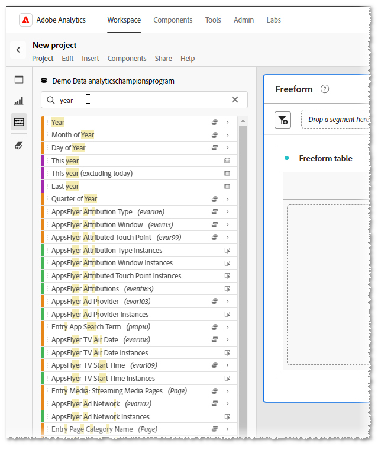

# 標籤 — 您的個人助理

_瞭解#TAGS如何簡化您的數位分析，以個人助理的身份有效找到您需要的內容。 Adobe Analytics Champion的Jeff Bloomer分享專家對於最大限度發揮工具的潛能為您帶來好處的見解。_

每個人都記得小時候玩過好玩的標籤遊戲，甚至是隱藏和搜尋，對嗎？

最好的部分是當我們是那些成功回到基礎（標籤）或隱藏時間最長（隱藏和搜尋）的人，直到我們聽到有人大喊「Olly Olly Oxen free！」 （「所有人免費出門」，衍生自德文：「alle alle auch sind frei！」）。  這最終表示其他人要麼已經成功加入、被找到，要麼有人被標籤為「it」，我們仍然可以自由地再玩一輪！

重要的部分是無論遊戲是標籤還是隱藏和搜尋，我們都在玩一種有趣的活動，在那裡人們一次又一次地被發現。

當我們轉向日常工作時，尋找東西似乎變得不那麼冒險，也更加乏味。 但如果我們願意在前端稍加努力，就不必非要這樣做。  我的家人很熟悉「最痛苦是自己造成的」這個詞。 不過，雖然這幾天似乎有點過時，但有一個更有名的短語在這件事上也非常相關：「及時縫合可省下九分」。  — 本傑明·富蘭克林

現在我已獲得您的注意，讓我先問您一個問題：

你們中有多少人做過這個？  您已開始搜尋&#x200B;**維度**、**日期範圍**、**區段**&#x200B;或&#x200B;**計算量度**，而您不想要的所有專案都會被這個龐大的清單淹沒（請參閱&#x200B;**圖1**）。  ***Analysis Workspace***&#x200B;認為它嘗試提供協助，但實際上它完全沒有幫助。

*圖1 — 搜尋「年」*

更棒的是，您已建立一些&#x200B;*新的* **日期範圍**&#x200B;和&#x200B;**區段**，而且由於它們「太新」，您可能會認為至少下次您進入&#x200B;***AdobeWorkspace***&#x200B;時，這些專案應該會快速且容易找到。 我是對的嗎？

我不想打破您的泡泡，但只要嘗試在您剛剛建立所有最新「小朋友」後離開&#x200B;***Adobe Analytics***，當您回來時，他們中的大多數只是逃跑了。  幸運的話，*或許*&#x200B;其中一個留下來等你，但其他已經很久了，玩捉迷藏遊戲了。

## 重寫規則手冊

從第一天起，這就是遊戲的方向，但如果我們可以改變規則呢？

事實上，如果我們能建立自己的個人助理，永久性地切換這些規則，該怎麼辦？

說真的，我們在這裡討論的就是TAGS！  沒錯!!  這是我們的朋友，主題標籤，以前稱為「號碼」和「井字型大小」，就像我們在電話上看到的一樣。  我們這些音樂家甚至稱之為「銳利化」。

若是您&#x200B;*確實*&#x200B;需要提醒的人，如下所示： **#**

無論如何，我們之所以討論&#x200B;**#tags**，是因為他們被歸入了「選擇性的貯體」，「乏味、無聊、讓人討厭的東西」中，每個人都傾向於忽略（例如描述），因為我們都在如此匆忙地建立更重要的東西，例如，哦，我不知道 — 

- Workspace報表
- 區段
- 計算量度
- 日期範圍

面對現實吧，夥計們！  您隨便舉個例子，我們都見過且聽過他們被略過的所有理由：

「哦，嘿，但那很容易。  我總是可以稍後再來，在幾個午餐時間更新這些東西，或者甚至在我正坐在會議桌前&#x200B;*完成所有工作*&#x200B;時，」所有從未做過的員工說。

## 工具箱內容

**Adobe**&#x200B;甚至已為WE THE PEOPLE完成立即建立一組精選#TAGS體的服務，因為……他們必須在某處開始我們的工作。  我稍後會提供一些額外警告，但我先展示的內容會為您帶來最大的效益！

在您建立自己的標籤之前，首先需要瞭解的是如何搜尋現有的&#x200B;**標籤**：

無論您是在新專案或現有專案，只需要前往元件搜尋列，輸入#hashtag案以及這些主要辭彙之一（只要觀看影片），然後按ENTER鍵，或直接開始捲動直到找到可辨識的辭彙為止。

第一則注意事項：如果您在開始建立&#x200B;*own*&#x200B;標籤時，遵循正確的命名慣例，請謹記在心，幾乎每一個&#x200B;*大寫*&#x200B;標籤（您看到的&#x200B;*應該*）都會使用，而且我會謹慎使用「應該」這個字，成為&#x200B;**Adobe**&#x200B;現成的標籤專案。  也就是說，請確定您建立的所有標籤皆為&#x200B;**小寫**。

## 建立您自己的個人助理

現在，讓我們回到我先前所說的「個人助理」。  如果我告訴您，您可以開始選取您最愛的一些現有元件，然後將其變更為您看到的唯一元件，該怎麼做？

1. 如果您開始選取多個元件（CTRL+按一下滑鼠左鍵），您會注意到一些圖示出現在最上方。  其中一個是TAG圖示。
1. 按一下該元件，然後開啟「標籤」對話方塊，您可以在此檢視與這些元件相關聯的任何現有標籤。
1. 然後，您可以從此畫面指派您目前可能想要的任何&#x200B;**額外/新**&#x200B;標籤。  （範例： **test\_v1**）
1. 若要在任何元件中新增NEW標籤，只要在按一下[儲存]按鈕前按一下鍵盤上的&#x200B;**ENTER**&#x200B;即可。
1. 然後，當您指派了新標籤後，您可以透過輸入主題標籤(#)和您的新標籤來搜尋它。

請原諒這個雙關語，但是「#tag，你成功了！」  您已經為您節省許多，未來更少搜尋！  現在，您可以瞭解您的盡職調查和努力工作最終將在何處發揮作用。

## 讓您的個人助理工作

假設我們在&#x200B;**旅遊業**&#x200B;工作，而且我們正在整理他們&#x200B;**核心營業時間**&#x200B;的報告。  如果我們只開始搜尋「旅遊」一詞，我們可能會得到比實際需要多得多的結果。  事實上，如果我們剛拿出&#x200B;**Workspace**，其中包含其中一半我們需要的結果，這些元件仍然無法輕易使用。

不過，如果我們每天都定期標籤&#x200B;**區段**、**量度**&#x200B;和其他相關的&#x200B;**元件**，而且可能在建立新的&#x200B;**工作區**&#x200B;時只建立幾個新元件，我們就會認真地展示如何改寫規則手冊以利於我們！

在此案例中，我為以下所有專案建立了一個簡單#tag稱：#core。

隨著您不斷養成工作習慣的這一部分，並不斷提升完成這工作的技能，您將會發現，使用#tags將變得更像擁有自己的個人助理。

想要更多真實世界的範例嗎？ 請考量下列事項：

1. 例如，在&#x200B;**2023**&#x200B;中尋找&#x200B;**所有季度**&#x200B;的&#x200B;**區段**&#x200B;和&#x200B;**日期範圍**&#x200B;的簡單方法？

   

   *額外的提示*：右方那個小正方形甚至可以讓您將排序順序變更為&#x200B;*字母順序*！

1. 當然，每個人都在一定程度上使用&#x200B;**行銷活動追蹤代碼**。  如果您只想清楚檢視&#x200B;*您的*&#x200B;玩具，請考慮將&#x200B;**#tag**&#x200B;新增至您真正需要檢視的核心專案，並篩選掉所有其他雜訊：

## 現在出去玩吧！

當然，小時候躲貓貓很有趣，但現在我們已經是成年人了。  我們沒有時間持續搜尋重要事項，因此請務必幫您自己一個忙，不要再浪費時間與工具抗爭。  重寫規則並讓工具為您運作。

### 標籤，您就是！

## 作者

本檔案的作者為：

**Jeff Bloomer**，Kroger Personal Finance數位分析經理

Adobe Analytics達人
